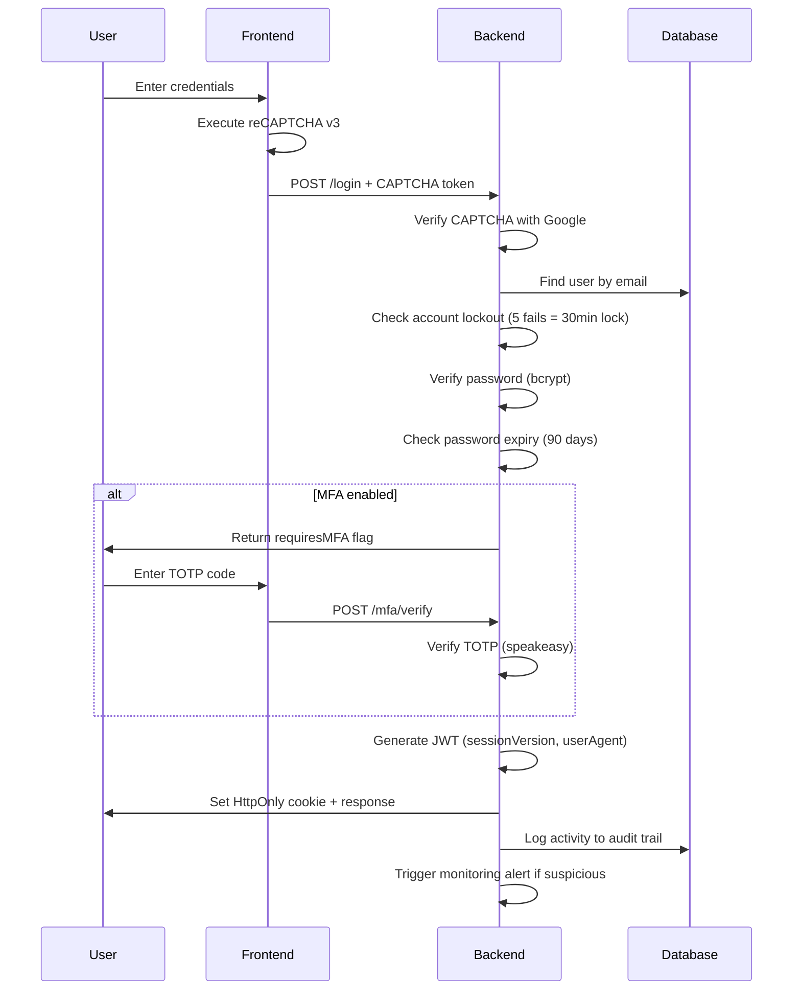

# 🐾 PawStore - Pet Accessories E-Commerce Platform

## 1. Application Purpose & User Need

### 1.1 Problem Statement
Pet owners face a fragmented experience when searching for their pets' needs — from finding the right breed information to purchasing quality accessories. Existing platforms typically offer either **educational content** (breed guides) or **e-commerce** (pet products), but rarely both in a single, secure, user-centric application.

### 1.2 User Need Addressed
PawStore bridges this gap by providing:
- **Comprehensive breed information** to help pet owners make informed decisions
- **Curated pet accessories** with secure transaction processing
- **Educational blog content** for pet care tips
- **A unified, secure platform** where all pet-related needs are met

### 1.3 Why PawStore is Unique & Meaningful
Unlike trivial CRUD applications, PawStore integrates:
- **Multi-Factor Authentication (MFA)** with TOTP authenticator apps
- **Real-time security monitoring** with webhook-based alerting
- **Energy-efficient infrastructure** (see Section 6)
- **Zero-trust security principles** in authentication design
- **GDPR-compliant data portability** (export/import)
- **CAPTCHA-protected registration** against automated attacks

### 1.4 User Benefits
- **Pet Owners**: One-stop platform for breed education and accessory shopping
- **Admin Staff**: Comprehensive monitoring dashboard for security oversight
- **All Users**: Enterprise-grade security (MFA, encryption, audit logging) typically not found in pet platforms

---

## 2. User-Centric Design & Accessibility

### 2.1 Interface Design
- Responsive Tailwind CSS design optimized for desktop and mobile
- Intuitive navigation with clear visual hierarchy
- Real-time form validation with inline error messages
- Loading states and skeleton screens for async operations

### 2.2 Accessibility Features
The following WCAG 2.1 AA guidelines are followed:
- **WCAG 1.1.1 (Non-text Content)**: All images have descriptive `alt` attributes
- **WCAG 1.3.1 (Info and Relationships)**: Semantic HTML structure with proper headings
- **WCAG 2.4.4 (Link Purpose)**: Links have descriptive text
- **WCAG 3.2.2 (On Input)**: Form inputs have associated `<label>` elements
- **WCAG 4.1.2 (Name, Role, Value)**: Interactive elements have proper ARIA attributes
- **Color Contrast**: WCAG AA minimum contrast ratio (4.5:1) maintained
- **Keyboard Navigation**: All interactive elements are keyboard-accessible
- **Focus Indicators**: Visible focus rings on all interactive elements

### 2.3 Accessibility Testing
- Manual keyboard-only navigation testing
- Browser DevTools accessibility audit
- Form error announcements via screen readers
- Touch target sizes ≥ 44×44px on mobile

---

## 3. Security Architecture

### 3.1 Zero-Trust Principles Applied
PawStore's authentication architecture follows zero-trust principles:

| Principle | Implementation |
|-----------|---------------|
| **Verify explicitly** | Every request is authenticated via JWT verification, regardless of network location |
| **Least-privilege access** | RBAC with User and Admin roles; API endpoints check authorization on every request |
| **Assume breach** | Session versioning for forced invalidation; User-Agent binding to detect token theft |
| **Continuous validation** | Password expiry (90 days), MFA verification on sensitive operations |

### 3.2 Encryption Strategy

#### Password Hashing
- **Algorithm**: bcrypt with 12 salt rounds
- **Justification**: bcrypt is intentionally slow, making brute-force attacks computationally expensive. The adaptive cost factor (12 rounds ~250ms per hash) provides future-proofing against hardware improvements. NIST SP 800-63B recommends bcrypt for password storage.
- **Key management**: Salt is generated automatically per-password (embedded in the bcrypt hash output)

#### Data at Rest (MFA Secrets)
- **Algorithm**: AES-256-GCM (Advanced Encryption Standard with 256-bit key in Galois/Counter Mode)
- **Justification**: AES-256-GCM provides authenticated encryption (confidentiality + integrity). GCM mode prevents padding oracle attacks that affect CBC mode. The 256-bit key exceeds NIST minimum requirements.
- **IV management**: Unique 96-bit random IV per encryption operation
- **Auth tag**: 128-bit authentication tag ensures tamper detection
- **Key storage**: Encryption key stored as server-side environment variable (`ENCRYPTION_KEY`), never in the database

#### Data in Transit
- **TLS 1.3** enforced in production via HTTPS redirect middleware
- **HSTS** headers set with 1-year `max-age` and `includeSubDomains`
- **Helmet.js** for security headers (CSP, X-Frame-Options, X-Content-Type-Options)

### 3.3 Authentication Flow


### 3.4 Session Management
- JWT with 24-hour expiry, stored in HttpOnly/Secure/SameSite=Strict cookies
- Session versioning for immediate invalidation on password change
- User-Agent binding to detect token theft
- No sensitive data in localStorage (only non-sensitive user profile cache)

### 3.5 Rate Limiting & Brute-Force Protection

| Endpoint | Window | Max Requests |
|----------|--------|-------------|
| Public read (breeds, blogs, accessories) | 15 min | 300 |
| General API | 15 min | 200 |
| Authentication (login, register) | 15 min | 10 |
| MFA verification | 15 min | 5 |
| Password change | 60 min | 3 |
| Profile updates | 60 min | 10 |

**Account Lockout**: 5 failed login attempts → 30-minute lockout period. Admin can manually unlock accounts.

---

## 4. Features Matrix

| Feature | Status | Details |
|---------|--------|---------|
| MFA (TOTP Authenticator) | ✅ | Google Authenticator, Authy via speakeasy |
| WebAuthn / Passkey Authentication | ✅ | Password-less login via FIDO2/WebAuthn standard |
| CAPTCHA (reCAPTCHA v3) | ✅ | Invisible CAPTCHA on login & register |
| Password Policy (12+ chars, complexity) | ✅ | Enforced frontend + backend |
| Password Expiry (90 days) | ✅ | Automatic expiry with login flag |
| Password Reuse Prevention (last 5) | ✅ | History stored in user document |
| Account Lockout (5 fails) | ✅ | 30-minute automatic lockout |
| IP-based Blocking & Allow-listing | ✅ | Auto-block after threshold + admin-managed lists |
| Token Revocation on Logout | ✅ | All tokens invalidated via `lastLogout` timestamp |
| RBAC (User/Admin) | ✅ | Least-privilege middleware |
| IDOR Protection | ✅ | Ownership verification on all user-scoped resources |
| Secure Cookies (HttpOnly/Secure/SameSite) | ✅ | Strict mode enabled |
| Session Versioning | ✅ | Invalidate on password change |
| User-Agent Binding | ✅ | Token theft detection |
| Activity Logging | ✅ | Daily rotated audit logs with sensitive data redaction |
| Real-time Monitoring | ✅ | Webhook alerts for critical security events |
| Data Export (GDPR) | ✅ | JSON format export |
| Data Import (GDPR) | ✅ | JSON format profile import |
| Account Deletion (Right to be forgotten) | ✅ | Password verified permanent deletion |
| TLS 1.3 Enforcement | ✅ | Production HTTPS redirect + HSTS |
| AES-256-GCM Encryption at Rest | ✅ | MFA secrets encrypted in database |
| Stripe Payment Processing | ✅ | PaymentIntents + Webhook signature verification |
| Stock Management | ✅ | Deducted on payment confirmation (not order creation) |
| Docker Containerization | ✅ | Multi-stage builds, non-root user |
| CI/CD Security Scanning | ✅ | SAST, Dependency audit, Trivy, Snyk |
| Internal Penetration Test | ✅ | OWASP WSTG v4.2 methodology, documented in `/penetration-test/` |

---

## 5. Technical Stack

| Layer | Technology |
|-------|-----------|
| Frontend | React 19, TypeScript, Vite, Tailwind CSS 4 |
| Backend | Node.js, Express 5, TypeScript |
| Database | MongoDB with Mongoose ODM |
| Authentication | JWT (jsonwebtoken), bcryptjs, speakeasy (MFA TOTP) |
| Payment | Stripe API (PaymentIntents + Webhooks) |
| CAPTCHA | Google reCAPTCHA v3 |
| Container | Docker, Docker Compose |
| CI/CD | GitHub Actions (SAST, Snyk, Trivy) |
| Password Strength | zxcvbn |

---

## 6. Energy-Efficient & Sustainable Code Practices

PawStore incorporates the following sustainable development practices:

### 6.1 Code Efficiency
- **Bundle optimization**: Vite tree-shaking eliminates unused code, reducing bandwidth
- **Lazy loading**: Route-based code splitting minimizes initial payload
- **Efficient data structures**: MongoDB indexes on frequently queried fields reduce CPU cycles
- **Connection pooling**: Reuse database connections instead of creating new ones

### 6.2 Infrastructure
- **Docker multi-stage builds**: Production images are ~80% smaller than dev images (Alpine base)
- **Health checks**: Prevent unnecessary container restarts and resource waste
- **Non-root containers**: Reduced attack surface eliminates need for additional security containers

### 6.3 Algorithmic Efficiency
- **bcrypt salt rounds**: Balanced at 12 (NIST minimum recommendation) — not unnecessarily high

---

## 7. Quick Start

### Prerequisites
- Node.js 20+
- Docker & Docker Compose (optional)

### Development Setup
```bash
# Backend
cd pawstore-backend
cp .env.example .env   # Configure environment
npm install
npm run dev

# Frontend (separate terminal)
cd Project-PawStore-Frontend
npm install
npm run dev
```

### Docker Setup
```bash
docker-compose up -d
```

---

## 9. Future Considerations & Advanced Features

### 9.1 Password-less Authentication (Passkeys / WebAuthn)
Passkeys (FIDO2/WebAuthn) have been evaluated as a future enhancement:
- **Why not yet implemented**: The current TOTP-based MFA satisfies the multi-factor requirement. WebAuthn requires:
  - HTTPS in development (challenging for local-only setups)
  - Browser-native API support considerations
  - Hardware key or platform authenticator management
- **Planned approach**: Integrate `@simplewebauthn/server` and `@simplewebauthn/browser` for passkey registration and authentication as a supplement to password-based login
- **Benefit**: Phishing-resistant authentication that aligns with zero-trust principles

### 9.2 IP Allow-listing
- Currently, rate limiting is IP-based with automatic blocking after threshold
- A dedicated IP allow-list for admin endpoints can be implemented using a middleware that checks against a configurable list of trusted IPs

### 9.3 Advanced Monitoring
- Integration with SIEM platforms (Splunk, ELK Stack) for centralized log analysis
- SMS/email alerting for critical security events via Twilio or SendGrid

---

## 8. Environment Variables

| Variable | Description |
|----------|-------------|
| `PORT` | Server port (default: 5000) |
| `MONGO_URI` | MongoDB connection string |
| `JWT_SECRET` | 64-char random hex string for JWT signing |
| `ENCRYPTION_KEY` | 64-char random hex string for AES-256-GCM |
| `STRIPE_SECRET_KEY` | Stripe API secret key |
| `STRIPE_PUBLISHABLE_KEY` | Stripe publishable key |
| `STRIPE_WEBHOOK_SECRET` | Stripe webhook signing secret |
| `RECAPTCHA_SITE_KEY` | Google reCAPTCHA site key |
| `RECAPTCHA_SECRET_KEY` | Google reCAPTCHA secret key |
| `MONITORING_WEBHOOK_URL` | Slack/Discord webhook for security alerts |
| `FRONTEND_URL` | Frontend URL for CORS |
